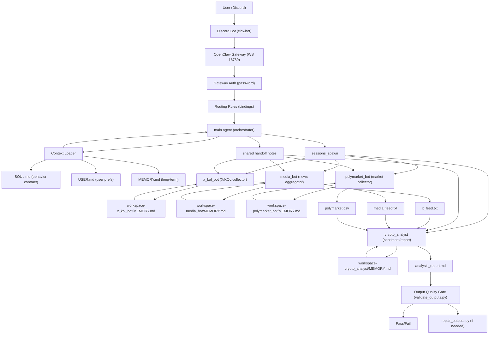

# Multi-Agents Assistant based on OpenClaw and Discord Bot

A local OpenClaw multi‑agent system for crypto market monitoring, integrated with a Discord bot. It collects KOL signals, prediction market data, and generates structured sentiment analysis reports.

## Architecture
Agents:
- `main`: default orchestrator, routes tasks to sub‑agents.
- `x_kol_bot`: collects high‑signal X (Twitter) KOL posts (X.com only).
- `media_bot`: aggregates top crypto news from Cointelegraph, CoinDesk, BlockBeats, The Block.
- `polymarket_bot`: collects prediction markets from Polymarket, Kalshi, CoinMarketCap Prediction Markets.
- `crypto_analyst`: aggregates x_kol_bot + media_bot + polymarket_bot and produces a report with views, trade ideas, risks.

Primary outputs (in `workspace/io/`):
- `x_feed.txt`
- `media_feed.txt`
- `polymarket.csv`
- `analysis_report.md`

Specs and templates:
- `<OPENCLAW_HOME>/workspace/OUTPUT_SPEC.md`
- `<OPENCLAW_HOME>/workspace-x_kol_bot/OUTPUT_TEMPLATE.md`
- `<OPENCLAW_HOME>/workspace-media_bot/OUTPUT_TEMPLATE.md`
- `<OPENCLAW_HOME>/workspace-polymarket_bot/OUTPUT_TEMPLATE.md`
- `<OPENCLAW_HOME>/workspace-crypto_analyst/OUTPUT_TEMPLATE.md`

## Repo Layout
- `<OPENCLAW_HOME>/openclaw.json` OpenClaw config
- `<OPENCLAW_HOME>/clawbot/` Discord bot implementation
- `<OPENCLAW_HOME>/clawbot.config.json` Discord bot config
- `<OPENCLAW_HOME>/workspace-*` Agent workspaces
- `<OPENCLAW_HOME>/logs/` Gateway and bot logs
- `<OPENCLAW_HOME>/workspace/io/` Aggregated IO artifacts
- `<OPENCLAW_HOME>/workspace/validation/` Validation utilities

## Discord Bot (clawbot)
Cogs-based bot with config in root.

Run manually:
```bash
<OPENCLAW_HOME>/.venv/bin/python <OPENCLAW_HOME>/clawbot/clawbot.py
```

LaunchAgent (daemon) config:
- `~/Library/LaunchAgents/com.openclaw.clawbot.plist`

Control:
```bash
launchctl load ~/Library/LaunchAgents/com.openclaw.clawbot.plist
launchctl start com.openclaw.clawbot
launchctl stop com.openclaw.clawbot
launchctl unload ~/Library/LaunchAgents/com.openclaw.clawbot.plist
```

## OpenClaw Gateway
Gateway is local with password auth.

Restart:
```bash
openclaw gateway restart
```

## Agent Routing
Current Discord binding routes to `main`:
- `<OPENCLAW_HOME>/openclaw.json` -> `bindings.agentId = "main"`

From Discord, ask `main` to spawn sub‑agents, for example:
- “启动 x_kol_bot 抓取 X 上的 KOL 内容”
- “让 media_bot 抓取今日媒体 TOP10”
- “让 polymarket_bot 更新 top20 预测市场”
- “用 crypto_analyst 生成分析报告”

## Security Placeholders
Replace secrets with placeholders in docs and configs.

Examples:
- `discord_token`: `YOUR_DISCORD_BOT_TOKEN`
- `gateway_password`: `YOUR_GATEWAY_PASSWORD`
- `api_key`: `YOUR_PROVIDER_API_KEY`

## Architecture Flow (OpenClaw Multi‑Agent)


## Local Development
Create venv and install dependencies:
```bash
python3 -m venv <OPENCLAW_HOME>/.venv
<OPENCLAW_HOME>/.venv/bin/python -m pip install discord.py
```

## Quality Gate
Validation scripts live in:
- `<OPENCLAW_HOME>/workspace/validation/validate_outputs.py`
- `<OPENCLAW_HOME>/workspace/validation/quality_gate.py`
- `<OPENCLAW_HOME>/workspace/validation/repair_outputs.py`

Suggested flow:
```bash
<OPENCLAW_HOME>/workspace/validation/quality_gate.py
```

## Notes
- Ensure agent auth profiles are configured under each agent dir in `<OPENCLAW_HOME>/agents/`.
- If a provider key is missing, OpenClaw will emit `FailoverError` in gateway logs.
